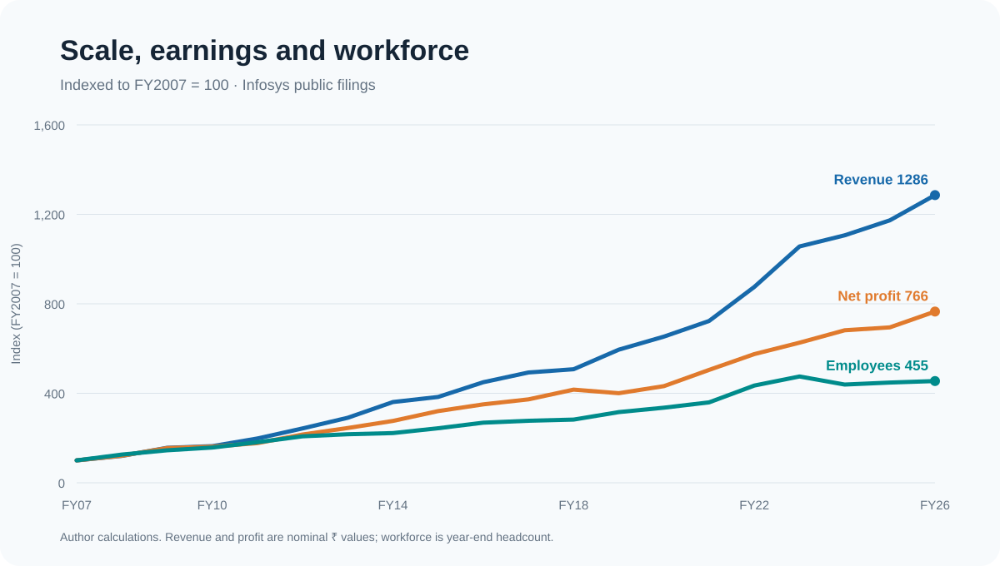
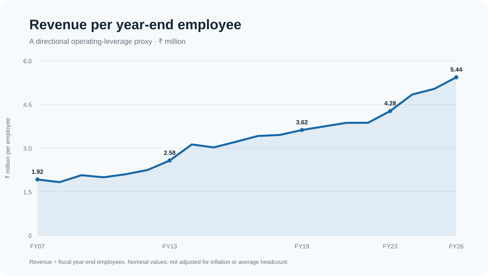
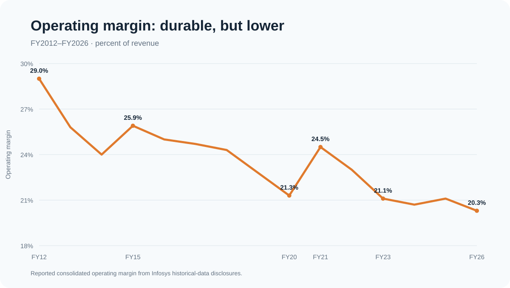
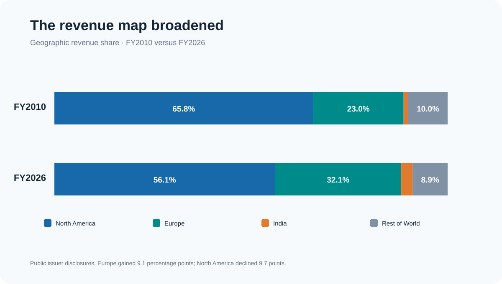
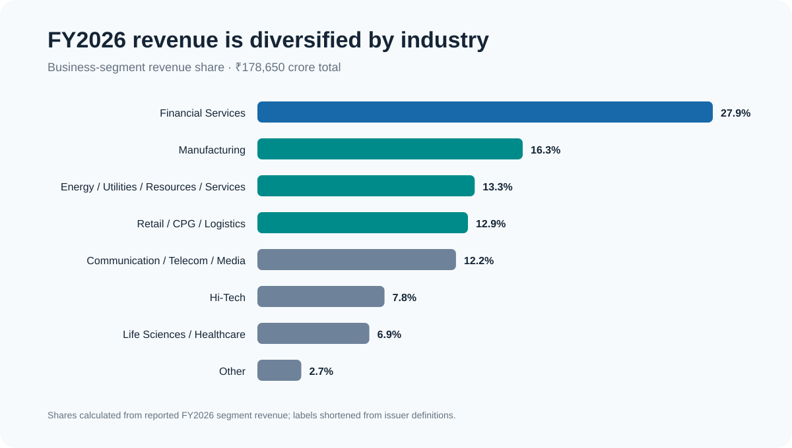
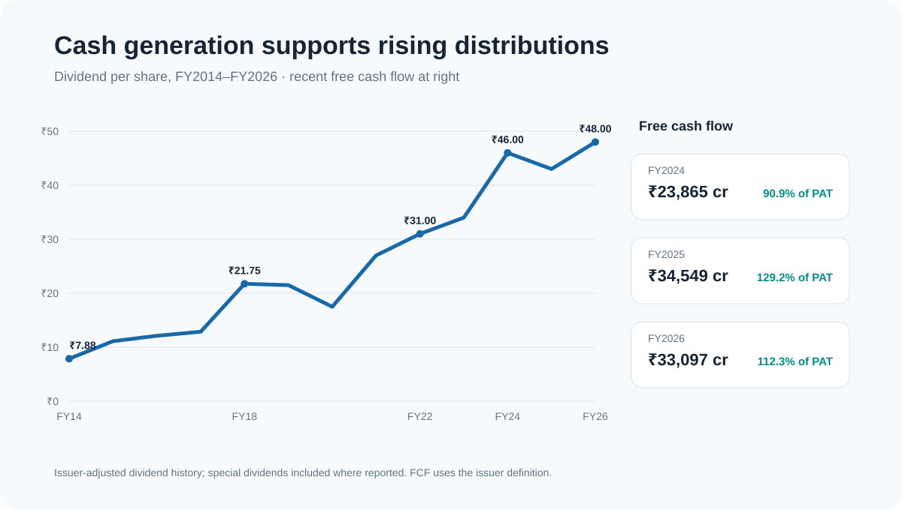

# Scaling with discipline?

## A public-source operating study of Infosys, FY2007–FY2026

This edition preserves the useful research question and the long-run analysis while rebuilding the evidence from public company filings. It contains no commercial-terminal export, screenshot, derived price series, private correspondence, or copied report design.

## The finding in one paragraph

Infosys expanded revenue from ₹13,893 crore in FY2007 to ₹178,650 crore in FY2026, a 12.9× increase and an annualized growth rate of about 14.4%. Net profit rose 7.7× over the same period, or roughly 11.3% annualized, while year-end headcount rose 4.5×, or about 8.3% annualized. Scale therefore outpaced both workforce and earnings: the operating model produced substantially more nominal revenue per employee, but profit did not compound as quickly as revenue.

## 1. Scale widened faster than the organization

| Measure | FY2007 | FY2026 | Change | Approx. CAGR |
| --- | ---: | ---: | ---: | ---: |
| Revenue | ₹13,893 cr | ₹178,650 cr | 12.9× | 14.4% |
| Net profit / PAT | ₹3,850 cr | ₹29,474 cr | 7.7× | 11.3% |
| Year-end employees | 72,241 | 328,594 | 4.5× | 8.3% |
| Revenue per year-end employee | ₹1.92m | ₹5.44m | 2.8× | 5.6% |

Revenue grew nearly three times as much as headcount in indexed terms. That is the clearest long-run operating signal in the public series: the company became larger without requiring a proportional increase in people.

Revenue per employee is a deliberately simple proxy. It benefits from price, currency, mix, utilization, automation, acquisitions and inflation, so it should not be read as a pure labor-productivity measure. Its value is directional: the economic output attached to each year-end employee is materially higher than it was in FY2007.

## 2. Earnings grew, but less quickly than revenue

The gap between the 12.9× revenue increase and 7.7× profit increase matters. It says that scale did not translate one-for-one into bottom-line compounding. The operating-margin history makes the trade-off visible.

The public comparable margin series falls from 29.0% in FY2012 to 20.3% in FY2026, a decline of 8.7 percentage points. The path was not linear: margin recovered to 24.5% in FY2021 before returning to roughly 20%–21% in FY2023–FY2026. The right conclusion is not that scale destroyed profitability; it is that the business sustained a high absolute profit pool while accepting a structurally thinner percentage margin.

## 3. The pandemic-era step-up was real, and so was the normalization

Revenue increased from ₹90,791 crore in FY2020 to ₹146,767 crore in FY2023, about 17.3% annualized. Headcount increased from 242,371 to 343,234 over those same year ends, about 12.3% annualized. The hiring cycle then reversed: headcount fell 7.6% in FY2024 even as revenue increased 4.7%.

By FY2026, revenue was 21.7% above FY2023 while headcount remained 4.3% below its FY2023 peak. Revenue per year-end employee consequently moved from roughly ₹4.28 million in FY2023 to ₹5.44 million in FY2026, a rise of about 27%. This is the strongest recent evidence for renewed operating leverage, though part of it reflects nominal growth and the use of year-end rather than average headcount.

## 4. Geographic concentration eased

North America remained the largest market, but its revenue share declined from 65.8% in FY2010 to 56.1% in FY2026. Europe moved the other way, from 23.0% to 32.1%. That 18.8-point swing between the two regions is meaningful diversification, though it does not remove exposure to large developed-market technology budgets.

The comparison uses two issuer-published snapshots rather than filling the intervening years from a restricted source. It therefore supports an endpoint conclusion, not a claim about a smooth annual path.

## 5. Industry exposure is broad, but financial services still leads

Financial Services represented 27.9% of FY2026 revenue. No other business segment exceeded 16.3%; Manufacturing, Energy / Utilities / Resources / Services, Retail / CPG / Logistics, and Communication / Telecom / Media each contributed between roughly 12% and 16%. The mix reduces dependence on a single vertical, while the largest segment remains important enough to shape the company’s cycle.

## 6. Cash generation translated into shareholder distributions

Dividend per share increased from an issuer-adjusted ₹7.88 in FY2014 to ₹48.00 in FY2026, a little over sixfold. Recent free cash flow was ₹23,865 crore in FY2024, ₹34,549 crore in FY2025 and ₹33,097 crore in FY2026. Those values equaled approximately 90.9%, 129.2% and 112.3% of reported PAT, respectively. Conversion above 100% in FY2025–FY2026 shows that cash generation exceeded accounting profit in those years; it should not be assumed to persist mechanically.

## 7. What this public edition can and cannot say

It can support the operating thesis with a twenty-year revenue, profit and workforce series, a fifteen-year margin series, geographic endpoint comparison, current business mix, dividend history, recent free-cash-flow conversion, original calculations, and links to the underlying filings.

It does not reproduce the former monthly price comparison, competitor series, terminal screenshots, geographic/segment exports, or source-derived report pages. Those sections should return only if they are independently rebuilt from inputs whose terms expressly allow public redistribution. Removing a vendor’s name or redrawing its values would not solve that rights problem.

## Method

The datasets are manual factual extractions from Infosys investor materials. The older and newer disclosures are joined as a trend series, with source IDs on every row. Revenue and profit are nominal ₹ crore values; employees are fiscal year-end headcount. CAGR is `(ending / beginning)^(1 / years) - 1`. Revenue per employee is revenue × 10,000,000 divided by year-end employees. Geographic figures are reported percentages. FY2026 business shares are calculated from reported segment revenue.

The long period crosses accounting and presentation changes. For that reason, this report emphasizes broad direction and discloses gaps instead of backfilling them from restricted material. See [the dataset notes](data/README.md) and [public data policy](DATA-POLICY.md).

## Sources

- [Infosys annual reports index](https://www.infosys.com/investors/reports-filings/annual-report/annual-reports.html)
- [FY2012 Additional Information](https://www.infosys.com/content/dam/infosys-web/en/investors/reports-filings/annual-report/annual/documents/ar-2012/PDFs/Additional_Information_12.pdf)
- [FY2021 Historical Data](https://www.infosys.com/investors/reports-filings/documents/additional-information-2020-21.pdf)
- [FY2026 Historical Data](https://www.infosys.com/investors/reports-filings/documents/additional-information-2025-26.pdf)
- [FY2010 Revenue Segmentation](https://www.infosys.com/content/dam/infosys-web/en/investors/reports-filings/annual-report/annual/documents/ar-2010/Additional-Information/Revenue-Segmentation.html)
- [FY2026 Consolidated Statements](https://www.infosys.com/investors/reports-filings/annual-report/annual/documents/2025-26/consolidated.pdf)
- [Investor FAQ and dividend history](https://www.infosys.com/investors/shareholder-services/faqs.html)
- [FY2024 Integrated Report](https://www.infosys.com/investors/reports-filings/annual-report/annual-reports/ar-2023-24.html)
- [FY2025 Integrated Report](https://www.infosys.com/investors/reports-filings/annual-report/annual-reports/ar-2024-25.html)

This is independent research, not investment, legal, tax or accounting advice. Company and product names are used only to identify the subject and sources; no affiliation or endorsement is implied.
