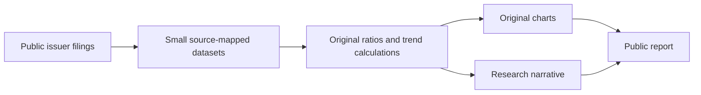
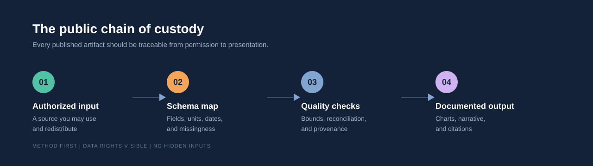
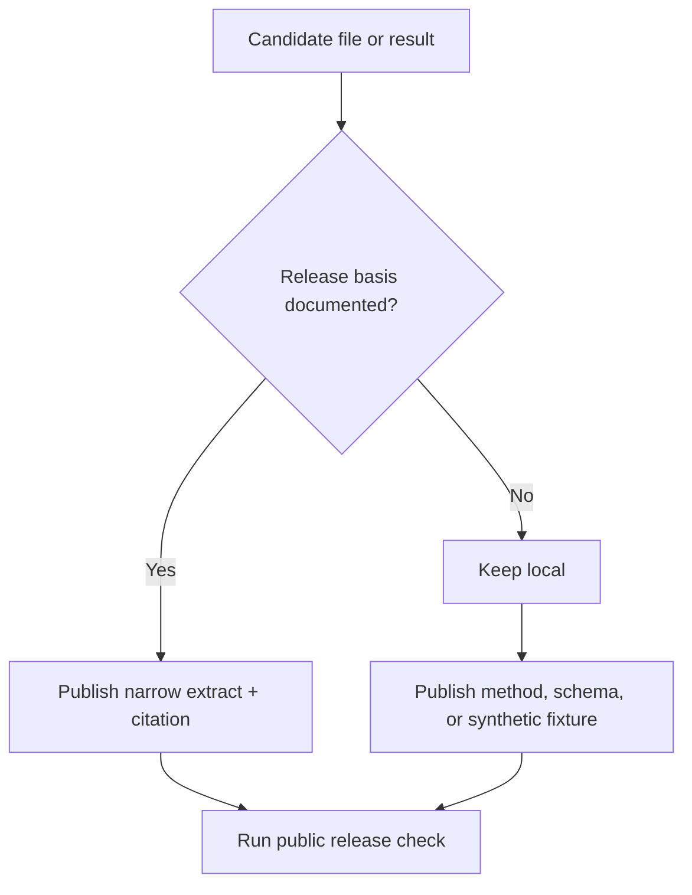

# Scaling with Discipline?

### A public-source long-run company analysis

<p align="center">
  
</p>

<p align="center">
  <strong>Twenty years of operating evidence, rebuilt from public company filings.</strong>
</p>

<p align="center">
  <a href="PUBLIC_REPORT.md">Read the public report</a> |
  <a href="data/public_company_history.csv">Inspect the data</a> |
  <a href="RIGHTS-AUDIT.md">Rights audit</a> |
  <a href="LICENSE">MIT for original code</a> |
  <a href="DATA-POLICY.md">Data policy</a> |
  <a href="CONTRIBUTING.md">Contributing</a> |
  <a href="examples/demo_series.csv">Synthetic fixture</a> |
  <a href="RELEASE_CHECKLIST.md">Release checklist</a>
</p>

---

## What this is

This repository contains a public-source operating study of Infosys from FY2007 through FY2026, plus the workflow used to inspect, normalize, check, and visualize long-run company data.

The analysis dataset was independently rebuilt from Infosys investor reports. Restricted exports, terminal screenshots, raw email material, and source-derived result files remain excluded. The public report recovers the central analysis—scale, earnings, workforce productivity, margin pressure, and the post-pandemic normalization—without disguising or reproducing restricted material.

The title question is the useful one:

> Can a company keep widening its scale without letting the economics thin out?

## The public release

| Included | Excluded |
| --- | --- |
| Extraction and inspection utilities | Raw or licensed data exports |
| Reproducibility guidance | Terminal screenshots and screen captures |
| Public-filing factual series | Derived datasets from restricted inputs |
| Original public research report | Redrawn copies of restricted charts |
| Original SVG illustrations | Private email archives and attachments |
| Code-only open-source licence | Third-party reports and branded content |

## Read the analysis

The [public report](PUBLIC_REPORT.md) contains the findings, limitations, methodology and source links. Its underlying [CSV](data/public_company_history.csv) carries a source ID on every row.

<p align="center">
  
</p>

The headline result is a genuine operating tension: from FY2007 to FY2026, revenue grew about 12.9×, profit about 7.7× and year-end headcount about 4.5×. Output per employee rose materially, while the comparable operating-margin series moved lower over time.



The diagram above is rendered by GitHub from Markdown; the detailed numeric charts remain available in the [public report](PUBLIC_REPORT.md).

## More than a code shell

The public edition now includes operating history, geographic mix, current business mix, capital-return history, original analysis, and reproducible charts. A small synthetic CSV remains only as a software test fixture; the repository showcases the real public-filing analysis instead.

<p align="center">
  
</p>

<p align="center">
  
</p>



## Quick start

```powershell
python public_release_check.py
python make_public_assets.py
python inspect_workbooks.py <path-to-authorized-workbook>
python list_workbook_rows.py <path-to-authorized-workbook>
python prepare_public_subset.py <authorized.csv> --keep year,revenue_index --rights-confirmed
```

The two inspection utilities are dependency-light. The broader extraction script uses `openpyxl` and expects the numbered input folders used by the original workflow. Those inputs are intentionally not included here.

`prepare_public_subset.py` is an opt-in minimization aid for a rights-cleared CSV. It uses an explicit column allow-list, rejects obvious direct identifiers, and can normalize named categorical columns. It does not decide whether the source or result may legally be published.

```powershell
python -m pip install openpyxl
python build_analysis_data.py
```

The command above is a template for an authorized local dataset. It will not produce a meaningful result from the public tree alone because no restricted source files are shipped with it.

## Project shape

```text
build_analysis_data.py       Extract selected annual and monthly series
inspect_workbooks.py         Inspect workbook structure and sheets
list_workbook_rows.py        Print workbook rows for manual mapping
probe_values.py              Probe selected cells during development
public_release_check.py      Check the public tree for policy mistakes
prepare_public_subset.py     Build a local, allow-listed CSV subset
examples/demo_series.csv     Synthetic, redistributable fixture
data/public_company_history.csv  Public-filing factual series with row-level source IDs
data/public_geography_mix.csv   Geographic mix snapshots from public filings
data/public_business_mix_fy2026.csv  Current business-segment revenue
data/public_capital_returns.csv  Dividend history and recent free cash flow
PUBLIC_REPORT.md             Public-source findings and methodology
RIGHTS-AUDIT.md              Public/private boundary by artifact type
make_public_assets.py        Regenerate the original public charts
assets/*.svg                 Original charts and conceptual visuals
DATA-POLICY.md               Public data boundary and provenance rules
NOTICE.md                    Third-party and trademark notice
```

## Reproducibility contract

Every contributed dataset should answer four questions:

1. Who published it?
2. What licence or permission allows redistribution?
3. What transformations were applied?
4. Can another person obtain the same input without private access?

If the fourth answer is no, keep the input and any derived output outside the public repository. Publish the schema, transformation code, and a synthetic fixture instead.

## Licence boundary

The [MIT License](LICENSE) covers original source code in this repository and the synthetic fixture. It does not grant rights to any data, image, document, trademark, or other material supplied by a third party. Read [NOTICE.md](NOTICE.md) and [DATA-POLICY.md](DATA-POLICY.md) before adding files.

Aggregation, de-identification, and category cleanup do not by themselves create permission to redistribute a restricted source or a result derived from it. Use the [release checklist](RELEASE_CHECKLIST.md) for any public data contribution.

The repository is an analytical software project. It is not investment advice, a data subscription, or a warranty about the accuracy of any input.

## Contributing

Small, reviewable contributions are welcome. Before opening a pull request, run:

```powershell
python public_release_check.py
git diff --check
```

Do not commit credentials, private correspondence, licensed exports, screenshots of commercial terminals, or a derived table whose redistribution rights are unclear. See [CONTRIBUTING.md](CONTRIBUTING.md).

## Citation

If this workflow helps your work, cite it using [CITATION.cff](CITATION.cff). Cite every external dataset separately, using the publisher's preferred wording.

## Contact

For a suspected rights, privacy, or credential issue, follow [SECURITY.md](SECURITY.md) rather than opening a public issue with the material attached.
